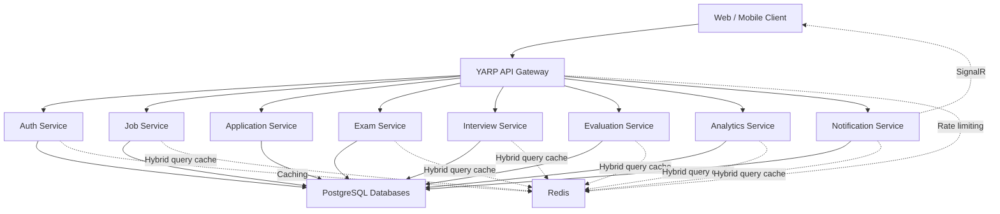

<div align="center">

# Vettingo

### A modular recruitment, candidate vetting, and technical assessment platform

Vettingo brings identity management, job postings, applications, assessments, interviews, evaluations, analytics, and real-time notifications together in a microservice-based backend.

<br />


</div>

---

## Overview

**Vettingo** is a backend platform designed to manage the complete recruitment and candidate evaluation lifecycle.

The system provides dedicated services for authentication, companies, job postings, applications, technical exams, structured interviews, evaluations, recruitment analytics, and real-time notifications.

It is built with **.NET 10**, **ASP.NET Core Web API**, **PostgreSQL**, **Redis**, and a modular microservice architecture.

### Supported roles

- **Admin**
- **Human Resources (HR)**
- **Company**
- **Candidate**

The exact seeded name of the HR role in the identity system is `Human Resources`.

---

## Features

### Identity and access management

- User registration and login
- JWT access-token authentication
- Refresh-token support
- Token revocation
- ASP.NET Core Identity integration
- Role-based authorization
- Company account management
- Admin, Human Resources, Company, and Candidate roles

### Job posting management

- Create, update, list, and delete job postings
- Search and filter job postings
- Employment type and experience-level support
- Working model management
- Job posting status tracking

### Job applications

- Candidate job applications
- Company-side application listing
- Application status management
- Candidate and company authorization policies

### Technical assessments

- Exam creation and management
- Multiple-choice questions
- True/false questions
- Classic open-ended questions
- Code-completion questions
- Candidate exam participation
- Company-controlled assessment content

### Interview management

- Interview exam creation
- Structured interview questions
- Candidate interview answers
- Interview question and exam management

### Candidate evaluations

- Candidate evaluation records
- Evaluation creation and updates
- Evaluation history
- Candidate-focused authorization

### Recruitment analytics

- Candidate recommendation analytics
- Candidate CV analysis
- Job posting performance tracking
- Company recommendation reports

### Real-time notifications

- Persistent user notifications
- Read and unread notification tracking
- SignalR-based real-time delivery
- Candidate and company notification support

### Gateway capabilities

- Central API routing with YARP
- Redis-backed request rate limiting
- Configurable CORS policies
- Service-based route prefixes

---

## Architecture

Vettingo follows a microservice architecture. Each business capability is separated into an independently structured service and exposed through a central API Gateway.



### Service layers

Most domain services are divided into the following projects:

| Layer | Responsibility |
|---|---|
| **API** | HTTP endpoints, authentication, middleware, exception handling |
| **Application** | CQRS requests, handlers, validation, business workflows |
| **Domain** | Entities, enums, and domain behavior |
| **Infrastructure** | External and technical service implementations |
| **Persistence** | Entity Framework Core contexts and repositories |

This structure keeps business rules independent from transport and persistence concerns.

---

## Services

| Service | Responsibility | Main API routes |
|---|---|---|
| **Gateway** | Reverse proxy, CORS, routing, rate limiting | `/auth`, `/job`, `/application`, `/exam`, `/interview`, `/evaluation`, `/analytics`, `/notification` |
| **Auth Service** | Users, roles, JWT tokens, refresh tokens, companies | `/api/auth`, `/api/company` |
| **Job Service** | Job postings, search, filters, posting lifecycle | `/api/job-postings` |
| **Application Service** | Job applications and application statuses | `/api/job-applications` |
| **Exam Service** | Exams and technical assessment questions | `/api/exams` |
| **Interview Service** | Interview exams, questions, and answers | `/api/interview-exams`, `/api/interview-questions`, `/api/interview-answers` |
| **Evaluation Service** | Candidate evaluations | `/api/evaluations` |
| **Analytics Service** | Recommendations, CV analysis, posting performance | `/api/analytics` |
| **Notification Service** | Persistent and real-time notifications | `/api/notifications`, `/notification-hub` |

---

## Roles and permissions

| Role | Purpose |
|---|---|
| **Admin** | Platform-level administration and company management |
| **Human Resources (HR)** | Dedicated identity role for recruitment and HR personnel |
| **Company** | Employer-side job, application, exam, interview, and analytics operations |
| **Candidate** | Job applications, assessments, interview participation, evaluations, and CV analysis |

JWTs contain the assigned roles under the `Role` claim. API endpoints use ASP.NET Core role-based authorization to protect operations.

---

## Technology stack

| Category | Technologies |
|---|---|
| **Runtime** | .NET 10, C# |
| **API** | ASP.NET Core Web API |
| **Architecture** | Microservices, layered architecture, CQRS |
| **Request dispatching** | FlashMediator |
| **Database** | PostgreSQL |
| **Data access** | Entity Framework Core, Npgsql |
| **Authentication** | ASP.NET Core Identity, JWT Bearer |
| **Gateway** | YARP Reverse Proxy |
| **Caching** | Redis, FlashMediator hybrid cache |
| **Real-time communication** | SignalR |
| **Validation** | FluentValidation |
| **Logging** | Serilog |
| **Testing** | xUnit, NSubstitute, FluentAssertions |
| **Code coverage** | Coverlet |

---

## Project structure

```text
Vettingo/
├── src/
│   ├── AnalyticsService/
│   ├── ApplicationService/
│   ├── AuthService/
│   ├── EvaluationService/
│   ├── ExamService/
│   ├── Gateway/
│   ├── InterviewService/
│   ├── JobService/
│   └── NotificationService/
│
├── tests/
│   ├── Vettingo.AnalyticsService.Tests/
│   ├── Vettingo.ApplicationService.Tests/
│   ├── Vettingo.AuthService.Tests/
│   ├── Vettingo.EvaluationService.Tests/
│   ├── Vettingo.ExamService.Tests/
│   ├── Vettingo.InterviewService.Tests/
│   ├── Vettingo.JobService.Tests/
│   └── Vettingo.NotificationService.Tests/
│
├── .github/
│   └── workflows/
│
└── Vettingo.slnx
```

The solution currently contains:

- **9 independently runnable applications**
- **40 source projects**
- **8 unit-test projects**

---

## Getting started

### Prerequisites

Make sure the following tools and services are available:

- [.NET 10 SDK](https://dotnet.microsoft.com/download)
- PostgreSQL
- Redis
- Git

Check the installed .NET SDK:

```bash
dotnet --version
```

The reported version should be `10.x` or newer.

### Clone the repository

```bash
git clone https://github.com/emreucbudak/Vettingo.git
cd Vettingo
```

### Restore dependencies

```bash
dotnet restore Vettingo.slnx
```

### Build the solution

```bash
dotnet build Vettingo.slnx
```

---

## Configuration

Each API project contains its own `appsettings.json` and `appsettings.Development.json` files.

Configure the required values for each service before starting the system.

A typical service configuration contains:

```json
{
  "ConnectionStrings": {
    "DefaultConnection": "Host=localhost;Port=5432;Database=vettingo_service;Username=postgres;Password=your_password",
    "Redis": "localhost:6379"
  },
  "JwtSettings": {
    "AccessTokenExpiration": 60,
    "RefreshTokenExpiration": 1,
    "SecretKey": "replace-with-a-long-and-secure-secret-key",
    "Issuer": "Vettingo",
    "Audience": "Vettingo.Client"
  }
}
```

Not every service requires every configuration entry.

### Important configuration notes

- Use separate PostgreSQL databases for independently deployed services.
- Use the same JWT issuer, audience, and signing secret across token-producing and token-validating APIs.
- Configure Redis for caching and Gateway rate limiting.
- Configure `AllowedOrigins` in the Gateway for client applications.
- Ensure Gateway destination addresses match the URLs used by the locally running services.
- Never commit production credentials or signing secrets to the repository.

ASP.NET Core environment variables can also be used:

```text
ConnectionStrings__DefaultConnection
ConnectionStrings__Redis
JwtSettings__SecretKey
JwtSettings__Issuer
JwtSettings__Audience
JwtSettings__AccessTokenExpiration
```

---

## Running locally

Each API can be started independently. Open a separate terminal for every service you want to run.

### Authentication Service

```bash
dotnet run --project src/AuthService/Vettingo.AuthService.API/Vettingo.AuthService.API.csproj
```

### Job Service

```bash
dotnet run --project src/JobService/Vettingo.JobService.API/Vettingo.JobService.API.csproj
```

### Application Service

```bash
dotnet run --project src/ApplicationService/Vettingo.ApplicationService.API/Vettingo.ApplicationService.API.csproj
```

### Exam Service

```bash
dotnet run --project src/ExamService/Vettingo.ExamService.API/Vettingo.ExamService.API.csproj
```

### Interview Service

```bash
dotnet run --project src/InterviewService/Vettingo.InterviewService.API/Vettingo.InterviewService.API.csproj
```

### Evaluation Service

```bash
dotnet run --project src/EvaluationService/Vettingo.EvaluationService.API/Vettingo.EvaluationService.API.csproj
```

### Analytics Service

```bash
dotnet run --project src/AnalyticsService/Vettingo.AnalyticsService.API/Vettingo.AnalyticsService.API.csproj
```

### Notification Service

```bash
dotnet run --project src/NotificationService/Vettingo.NotificationService.API/Vettingo.NotificationService.API.csproj
```

### API Gateway

Start the Gateway after the required backend services are running:

```bash
dotnet run --project src/Gateway/Vettingo.Gateway.API/Vettingo.Gateway.API.csproj
```

---

## Default development addresses

| Application | HTTP address |
|---|---|
| Gateway | `http://localhost:5135` |
| Auth Service | `http://localhost:5254` |
| Job Service | `http://localhost:5257` |
| Exam Service | `http://localhost:5260` |
| Analytics Service | `http://localhost:5266` |
| Application Service | `http://localhost:5267` |
| Evaluation Service | `http://localhost:5083` |
| Interview Service | `http://localhost:5077` |
| Notification Service | `http://localhost:5149` |

HTTPS profiles are also available through each API project's `launchSettings.json`.

---

## API overview

### Authentication

```text
POST /api/auth/register
POST /api/auth/login
POST /api/auth/refresh-token
POST /api/auth/revoke
```

Registration accepts one of the identity roles configured by the system:

```json
{
  "name": "Jane",
  "surname": "Doe",
  "email": "jane@example.com",
  "password": "your-secure-password",
  "role": "Human Resources"
}
```

### Companies

```text
GET    /api/company
GET    /api/company/{companyId}
POST   /api/company
PUT    /api/company/{companyId}
DELETE /api/company/{companyId}
```

### Job postings

```text
GET    /api/job-postings
GET    /api/job-postings/search
GET    /api/job-postings/{jobPostingId}
POST   /api/job-postings
PUT    /api/job-postings/{jobPostingId}
DELETE /api/job-postings/{jobPostingId}
```

### Job applications

```text
GET  /api/job-applications
POST /api/job-applications
PUT  /api/job-applications/{applicationId}/status
```

### Exams and questions

```text
GET    /api/exams
GET    /api/exams/{examId}
POST   /api/exams
PUT    /api/exams/{examId}
DELETE /api/exams/{examId}
```

Question resources are grouped under an exam:

```text
/api/exams/{examId}/questions/multiple-choice
/api/exams/{examId}/questions/true-false
/api/exams/{examId}/questions/classic
/api/exams/{examId}/questions/code-completion
```

### Interviews

```text
/api/interview-exams
/api/interview-questions
/api/interview-answers
```

### Evaluations

```text
GET    /api/evaluations
GET    /api/evaluations/{evaluationId}
POST   /api/evaluations
PUT    /api/evaluations/{evaluationId}
DELETE /api/evaluations/{evaluationId}
```

### Analytics

```text
POST /api/analytics/recommendations
GET  /api/analytics/companies/{companyId}/recommendations

POST /api/analytics/job-postings/performance
GET  /api/analytics/job-postings/{jobPostingId}/performance

POST /api/analytics/candidates/cv-analysis
GET  /api/analytics/candidates/{candidateId}/cv-analysis
```

### Notifications

```text
GET  /api/notifications/user/{userId}
GET  /api/notifications/user/{userId}/unread
POST /api/notifications
PUT  /api/notifications/{notificationId}/read
```

SignalR clients can connect to:

```text
/notification-hub
```

API projects also contain `.http` files that can be used for manual request testing from supported IDEs.

---

## Testing

Run every unit-test project:

```bash
dotnet test Vettingo.slnx
```

Run the tests with code coverage collection:

```bash
dotnet test Vettingo.slnx --collect:"XPlat Code Coverage"
```

The test suite covers areas such as:

- Domain entity behavior
- CQRS command and query handlers
- Repository implementations
- Authentication token generation
- Application workflows
- Exam and interview logic
- Notification behavior
- Job posting search

---

## Engineering practices

The project applies the following practices:

- Service-oriented domain separation
- CQRS command and query handlers
- Repository abstraction
- Dependency injection
- Fluent request validation
- Centralized exception handling
- JWT role-based authorization
- Distributed and local query caching
- Structured request logging
- Unit testing with mocks and in-memory databases
- Service-focused continuous integration workflows

---

## Contributing

Contributions are welcome.

1. Fork the repository.
2. Create a feature branch.

```bash
git checkout -b feature/your-feature-name
```

3. Implement your changes.
4. Add or update tests.
5. Run the full test suite.

```bash
dotnet test Vettingo.slnx
```

6. Commit your changes and open a pull request.

---

<div align="center">

Built with **.NET 10**, PostgreSQL, Redis, and a microservice architecture.

</div>
